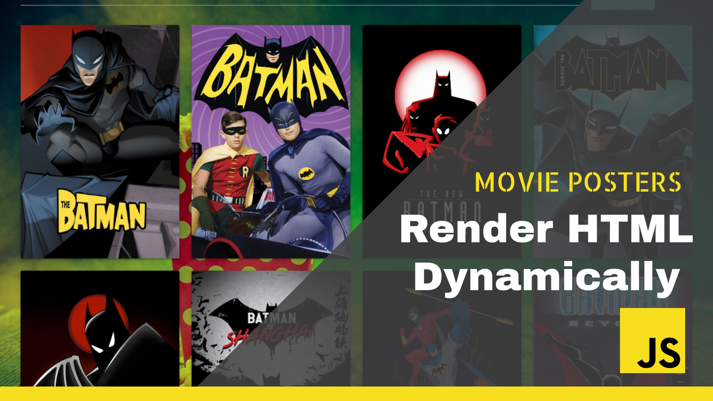

# RENDER HTML DYNAMICALLY

## Dependencies

        <link rel="stylesheet" href="https://cdnjs.cloudflare.com/ajax/libs/materialize/1.0.0/css/materialize.min.css">

    <link rel="preconnect" href="https://fonts.gstatic.com">
    <link href="https://fonts.googleapis.com/css2?family=Oi&display=swap" rel="stylesheet">

    

    

...
    
    

        <nav>
            

                <a href="#"  class="brand-logo center">Movie Posters</a>

            

        </nav>

        

            

                

                    <input placeholder="Search" type="text" name="movie_search" id="movie_search">
                

                

                    <button class="btn waves-effect waves- btn-large" id="button">Search</button>
                

            

            

               
        

    

capture the required elements

    const button = document.getElementById('button');
    const row_body = document.getElementById('row-body');

add event listener on the search button
    
    button.addEventListener('click',async () =>{}

then define the function that will make the api calls

    async function fetchName() {
        let value = document.getElementById('movie_search').value;
        const response = await fetch(`http://api.tvmaze.com/search/shows?q=${value}`);
        shows = await response.json();
        return shows;
    }    

inside the 